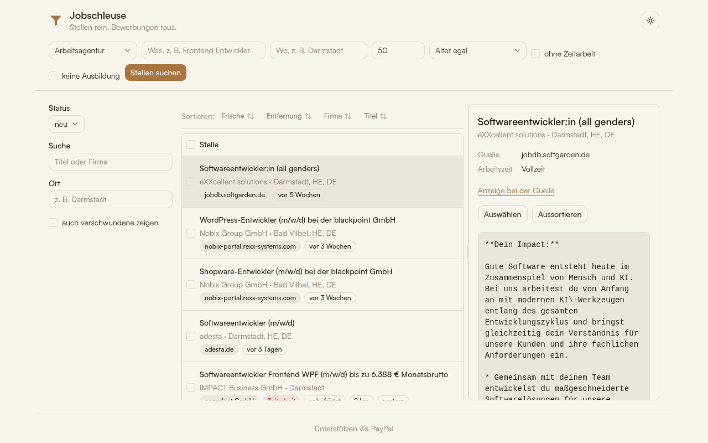

# Jobschleuse

**Stellen finden, anreichern und zur fertigen Bewerbung machen — lokal, ohne SaaS.**

_Stellen rein, Bewerbungen raus._

Python · FastAPI + React/shadcn · SQLite · uv

---

Sucht Stellenangebote bei der Bundesagentur für Arbeit und optional bei
Indeed, reichert sie um Fakten an, die die Trefferliste allein nicht hergibt
(Herkunft, Vermittlerart, Gehalt, Homeoffice, Entfernung, Frische), erkennt
verschwundene Anzeigen von selbst und füllt für die ausgewählten eine
Bewerbungsvorlage per LLM.

## Funktionsumfang

| Bereich | Beschreibung |
|---|---|
| Suche | Bundesagentur-Schnittstelle (`fetch`) und Indeed via jobspy (`fetch-indeed`); Filter nach Umkreis, Alter (`--since`), ohne Zeitarbeit, nur Arbeitsstellen (keine Ausbildung) |
| Anreicherung | Herkunft (Direktarbeitgeber/Vermittler/Zeitarbeit), Gehalt, Homeoffice, Vertrag, Arbeitszeit, Adresse, Entfernung — parallel nachgeladen, ohne die Suche zu verlangsamen |
| Bestandspflege | erkennt bei jeder Suche und per `jobs check`, welche gespeicherten Anzeigen bei der Quelle verschwunden sind; markiert statt zu löschen |
| Verwaltung | Status je Stelle (`new` / `selected` / `rejected`) über CLI oder Weboberfläche |
| Vorlage & Slots | eigene HTML-Vorlage mit `data-slot`-Markierungen, Textblöcke werden per LLM aus Profil + Stellenanzeige gefüllt, einzeln nachbearbeitbar |
| Export | fertiges PDF (via lokalem Chromium) plus HTML/CSS/Assets für Nachkorrekturen von Hand |

## Schnellstart

    uv sync
    cp .env.example .env                   # LLM_BASE_URL, LLM_API_KEY, LLM_MODEL eintragen
    cp profile.yaml.example profile.yaml   # persönliche Daten eintragen

    uv run jobs fetch --what "Mechatroniker" --where "Frankfurt" --radius 50 \
        --since 14 --no-temp-agency --jobs-only
    uv run jobs check             # Bestand auf verschwundene Anzeigen prüfen
    uv run jobs list --status new
    uv run jobs pick 3
    uv run jobs generate 3        # → out/<firma>/index.html

Für den PDF-Export muss zusätzlich ein Chromium-Browser installiert sein
(`chromium`, `google-chrome` oder `brave` — Playwright steuert ihn nur,
lädt aber selbst keinen nach). Ohne das läuft alles außer `jobs generate`
normal, der Export bricht mit einer entsprechenden Meldung ab.

## Für Agents

Die CLI ist so gebaut, dass ein Agent (z. B. Claude Code) Stellen ohne
Rückfragen sichten, gegen `profile.yaml` bewerten und vorsortieren kann.
Mit `--json` steht auf stdout nur JSON, Meldungen gehen nach stderr.
Exit-Codes: `0` ok, `1` fachlicher Fehler (unbekannte ID, ungültiger
Score), `2` Aufruffehler.

    uv run jobs fetch --what "Frontend" --where "Darmstadt" --json
    # {"fetched": 40, "new": 12, "gone": 3}

    uv run jobs list --unrated --json          # kompakt, ohne Beschreibung
    uv run jobs show 12 15 --json              # voll, inkl. description_md

    uv run jobs rate 12 --score 85 --reason "Stack passt" --tags python,react
    uv run jobs rate --stdin --json <<'EOF'
    {"id": 12, "score": 85, "reason": "Stack passt", "tags": ["python", "react"]}
    {"id": 15, "score": 20, "reason": "Zeitarbeit, kein Remote"}
    EOF
    # {"rated": 2}

    uv run jobs list --min-score 70 --sort score --json
    uv run jobs pick 12 --json                 # {"status": "selected", "ids": [12]}
    uv run jobs reject 15 17 18

`list`-Filter: `--status`, `--query`, `--location`, `--unrated`,
`--min-score`, `--include-gone`, `--sort id|fresh|distance|score`,
`--limit`. `rate --stdin` prüft alle Zeilen vor dem Schreiben — ist eine
ungültig, wird nichts gespeichert. `show` kann für Arbeitsagentur-Stellen
mit kurzer Beschreibung den Volltext nachladen (Netzzugriff).

## Weboberfläche

    uv run jobs serve            # → http://127.0.0.1:8765

React + shadcn/ui, gegen eine JSON-API unter `/api/*`. Stellenliste mit
Filtern, Sortierung und Bulk-Aktionen (mehrere Stellen auf einmal
auswählen/aussortieren), Command-Palette (Strg/Cmd+K) zum schnellen
Springen zu einer Stelle, Bewerbung erzeugen, einzelne Textblöcke per
Auto-Save nachbearbeiten oder neu erzeugen lassen, Live-Vorschau,
exportieren. Hell/Dunkel umschaltbar. Läuft ausschließlich lokal, ohne
Login. Das CLI bleibt unverändert nutzbar, beide teilen sich dieselbe
Business-Logik.

Das Frontend liegt in `frontend/` (Vite + React + TypeScript) und wird
fertig gebaut committed (`frontend/dist/`) — `uv run jobs serve` bleibt der
einzige nötige Startbefehl, kein Node zur Laufzeit. Wer am Frontend
arbeitet: `cd frontend && npm install && npm run dev` für einen
Dev-Server mit Hot-Reload (proxied auf die FastAPI-API), `npm run build`
vor dem Commit, `npm test` für die Vitest-Suite.

Jede Suche prüft nebenbei, ob die bereits gespeicherten Anzeigen bei der
Quelle noch vorhanden sind. Verschwundene werden markiert und ausgeblendet,
bleiben aber über „auch verschwundene zeigen" erreichbar — samt einer
eventuell schon erzeugten Bewerbung.

## Architektur

    src/bewerbungs_pipeline/
      sources/arbeitsagentur.py   Suche, Anreicherung, Verfügbarkeitsprüfung
      sources/indeed.py           Suche über python-jobspy
      sources/normalisierung.py   Rohwerte der Quelle → Anzeigewerte (rein, ohne Seiteneffekt)
      db.py                       SQLite-Schema, Migration, Zugriff
      models.py                   JobItem — Datenmodell für Stellen
      applications.py             Bewerbung anlegen, Slots füllen (LLM), Beschreibung nachladen
      llm.py                      LLM-Client, Antwortschema, Validierung
      slots.py                    data-slot-Erkennung in HTML-Vorlagen
      pdf.py                      Export über lokales Chromium (Playwright)
      cli.py                      Kommandozeile
      web/                        FastAPI: JSON-API (/api/*), liefert das React-Frontend aus

    frontend/                     Vite + React + TypeScript + shadcn/ui
      src/features/stellen/       Liste, Filter, Detail, Command-Palette
      src/features/bewerbung/     Slot-Editor, Vorschau
      dist/                       Build-Ergebnis, committed

## Vorlagen

`templates/` enthält:

- `beispiel.html` – Demo-Vorlage (Minimal-Beispiel, Default).
- `beispiel-org.html` – Demo-Vorlage mit organisationsspezifischen Slots.
- `styles.css` – Geteilte Styles für eigene Vorlagen.
- eigene Vorlagen (z. B. `bewerbung.html` + `assets/`) sind bewusst nicht Teil
  des Repos — persönliche Daten wie Foto oder Unterschrift bleiben lokal.

### Eigene Vorlage anschließen

1. HTML-Datei nach `templates/<name>.html` kopieren.
2. Jeden Textblock, der pro Bewerbung wechseln soll, mit
   `data-slot="name"` markieren (eindeutige Namen). Alles ohne `data-slot`
   bleibt unverändert.
3. `TEMPLATE_PATH=templates/<name>.html` in `.env` setzen.
   Ohne eigenen Schritt läuft alles mit der Demo-Vorlage
   (`TEMPLATE_PATH=templates/beispiel.html`).

## Ergebnis des Exports

Je Bewerbung entsteht `out/<firma>/`:

- `Bewerbung_<Name>_<Firma>.pdf` – das fertige Dokument
- `index.html`, `styles.css`, `assets/` – dieselbe Bewerbung als HTML, für
  Nachkorrekturen von Hand
- `stelle.md` – die Stellenanzeige zum Nachlesen

Die Vorlage bringt Schriften, Icons und Bilder lokal mit — Vorschau und PDF
sehen deshalb offline genauso aus wie online.

## Datenschutz

Alle Daten (Stellen, Profil, Status, exportierte Bewerbungen) bleiben lokal
in SQLite bzw. auf der Platte. Einzig der LLM-Aufruf zum Textfüllen verlässt
den Rechner, mit frei wählbarem Endpunkt (`LLM_BASE_URL`).

## Unterstützen

Jobschleuse ist Open Source und kostet nichts. Wer's nützlich findet:

- **PayPal** — https://paypal.me/AlainRitter
